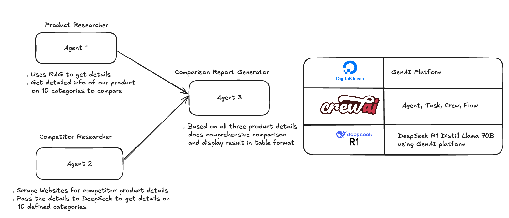

# Market Research Assistant

This project is part of the [AI/ML Bootstrapper](https://github.com/hivenetes/ai-ml-bootstrapper) repository. It is a Streamlit-based web application that provides a beautiful visualization of market research between Narsi (A new AI tool), GitHub Copilot, and Cursor. You can change the product name to any product you want to compare.




## Prerequisites

- Python 3.12.2
- A DigitalOcean account with access to GenAI Platform
- Basic knowledge of command line operations
- Git installed on your system

## Features

- Interactive comparison table
- Downloadable CSV export
- Detailed category-wise comparison
- Responsive design

## Installation

1. Clone the repository:

``` bash
git clone https://github.com/hivenetes/ai-ml-bootstrapper.git
cd ai-ml-bootstrapper/market-research-assistant
```

2. Create a virtual environment:

``` bash
python -m venv venv
```

3. Activate the virtual environment:

``` bash
source venv/bin/activate
```

4. Install required packages:

``` bash
pip install -r requirements.txt
```

5. Create GenAI Agents:
- Login to [DigitalOcean](https://cloud.digitalocean.com/login).
- For Product Research agent which is the first agent:
        - upload product_narsi.md file (available in the root directory) to spaces object storage.
        - create a knowledge base choosing the newly created spaces object storage as the source.
        - attach knowledge base to the agent. 

  To learn more about creating agents, refer to [GenAI Documentation](https://docs.digitalocean.com/products/genai-platform/how-to/manage-ai-agent/).
- Create an Agent each for Competitor Research, and Comparison Report.
- Agent instructions are available in the `docs/agent_instructions.txt` file.
- Copy the endpoints and keys for each agent.


6. Set the environment variables:  

- Copy .env.example file and create a .env file in the root directory.
- Update the following variables from previous step:

``` bash
GENAI_PRODUCT_RESEARCHER_AGENT_ENDPOINT=<your-agent-endpoint>
GENAI_PRODUCT_RESEARCHER_AGENT_KEY=<your-agent-key>

GENAI_COMPETITOR_RESEARCHER_AGENT_ENDPOINT=<your-agent-endpoint>
GENAI_COMPETITOR_RESEARCHER_AGENT_KEY=<your-agent-key>

GENAI_COMPARISON_REPORT_AGENT_ENDPOINT=<your-agent-endpoint>
GENAI_COMPARISON_REPORT_AGENT_KEY=<your-agent-key>
```

4. Run the application:

``` bash
streamlit run src/app.py
```

5. Open your browser and navigate to `http://localhost:8501`


## Project Structure

- `src/app.py`: Main Streamlit application file.
- `src/crew_flow.py`: The main logic for the market research assistant.
- `src/product_research.py`: The logic for the product research task.
- `src/competitor_research.py`: The logic for the competitor research task.
- `src/comparison_report.py`: The logic for the comparison report task.
- `requirements.txt`: List of dependencies.
- `README.md`: This file.
- `docs/product_narsi.md`: The product information for Narsi.
- `docs/agent_instructions.txt`: The instructions for the agents.
