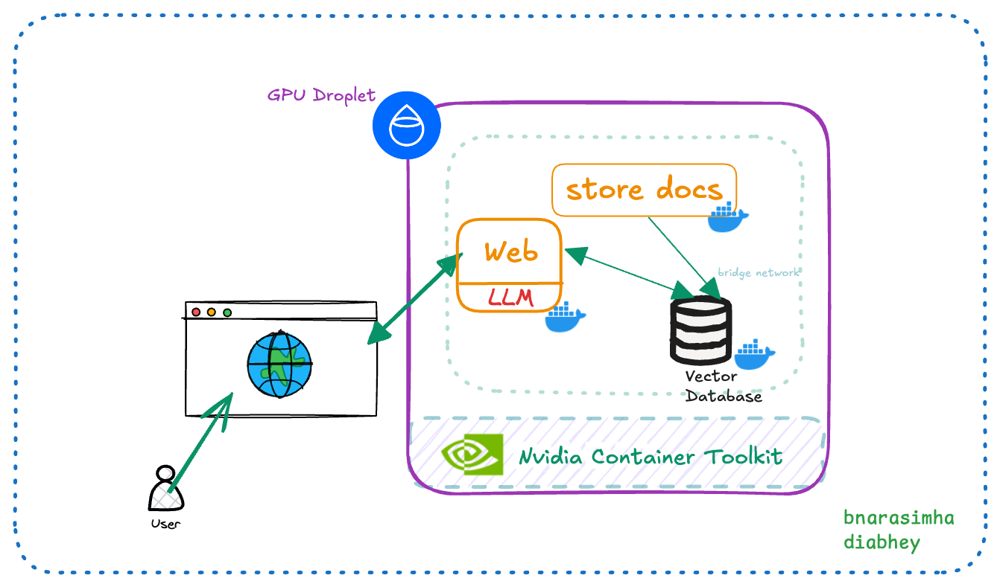

# Containerized RAG Pipeline

This guide walks you through setting up a Retrieval-Augmented Generation (RAG) pipeline on a DigitalOcean GPU Droplet with DigitalOcean Spaces for object storage.

## Prerequisites

Before starting, ensure you have the following:

- A [DigitalOcean account](https://cloud.digitalocean.com/registrations/new).
- `doctl` CLI installed. Follow the [installation guide](https://docs.digitalocean.com/reference/doctl/how-to/install/).
- Run the `./scripts/prerequisites.sh` script to install dependencies (this script installs any required tools and libraries).
        - [Important]: This steps involves reboot of the VM

> **Note**: These steps are platform-agnostic and should work on any OS with minor adjustments.

## Set up Infrastructure

### 1. Spin Up a GPU Droplet

Use the following command to create a GPU droplet in the `TOR1` datacenter, equipped with a single H100 GPU:

```bash
doctl compute droplet create <droplet-name> \
    --region tor1 \
    --image mliab-single-gpu \
    --size gpu-h100x1-80gb \
    --ssh-keys <ssh::fingerprint>
```

### 2. Create a DigitalOcean Spaces Bucket

Create a new Spaces bucket by following the [DigitalOcean Spaces documentation](https://docs.digitalocean.com/products/spaces/how-to/create/).

> **Note**: Be sure to note the endpoint URL after the bucket is created for use in the next steps.

## Prepare the Environment

1. SSH into your GPU Droplet:
    ```bash
    ssh root@<gpu-droplet-ip>
    ```

2. Clone the repository:
    ```bash
    git clone https://github.com/hivenetes/ai-ml-bootstrapper
    cd ai-ml-bootstrapper/rag-containers
    ```

## DigitalOcean Spaces Configuration

1. Copy the example Spaces configuration file:
    ```bash
    cp store_service/spaces-example.cfg store_service/spaces.cfg
    ```

2. Update the `spaces.cfg` file with your DigitalOcean Spaces credentials:
    ```bash
    DO_SPACES_REGION=<your-region>
    DO_SPACES_ENDPOINT_URL=<your-endpoint-url>
    DO_SPACES_KEY=<your-access-key>
    DO_SPACES_SECRET=<your-secret-key>
    DO_SPACES_BUCKET_NAME=<your-bucket-name>
    ```

> Save and close the file after updating the credentials.

## Upload Custom Data to DigitalOcean Spaces

To upload custom data (e.g., PDFs or files) to your Spaces bucket, follow the steps outlined in [this guide](https://docs.digitalocean.com/products/spaces/how-to/add-and-remove-files/).

## Run the Application

Once your environment is set up, run the application using the following command:

```bash
export NVIDIA_RUNTIME=true && ./run.sh
```

This will spin up the demo using the containerized environment configured to utilize NVIDIA GPU acceleration.


