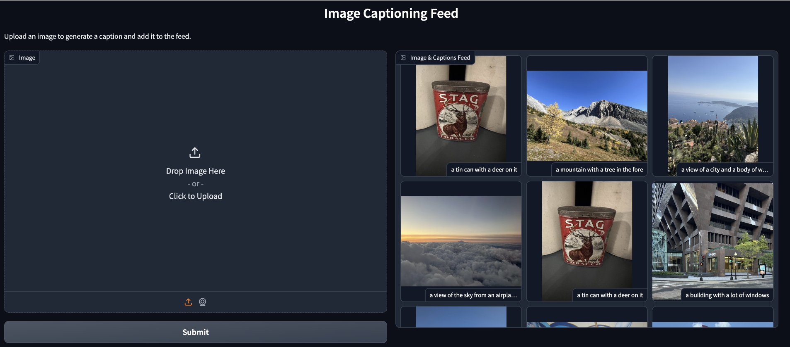

# SnapInsight

This project is a web application that allows users to upload images, generate captions using a pre-trained BLIP model, and display the images along with their captions in a gallery. The application is built using Gradio for the web interface and utilizes the `transformers` library for image captioning.

## Features

- Upload images from your device or capture using a webcam (if on a laptop).
- Generate captions for uploaded images using the BLIP model.
- Display images and their captions in a gallery.
- Save images and captions to a JSON file for persistence.

## Requirements

- Python 3.7+
- `gradio`
- `Pillow`
- `torch`
- `transformers`
- `user_agents`

## Installation

1. Clone the repository:
    ```sh
    git clone https://github.com/hivenetes/ai-ml-bootstrapper/tree/main/snap-insight
    cd snap-insight
    ```

2. Create a virtual environment and activate it:
    ```sh
    python -m venv venv
    source venv/bin/activate  # On Windows use `venv\Scripts\activate`
    ```

3. Install the required packages:
    ```sh
    pip install -r requirements.txt
    ```

## Usage

### Method 1
1. Run the application:
    ```sh
    python app.py
    ```

2. Open your web browser and navigate to `http://0.0.0.0:7860`.

3. Upload an image or capture one using your webcam (if on a laptop).

4. Click the "Submit" button to generate a caption and add the image to the gallery.

### Method 2
You can also run the application by executing run.sh file under scripts folder by providing just the droplet name, huggingface token and ssh fingerprint
```sh
cd scripts  
chmod +x run.sh
./run.sh
```

## File Structure

- `app.py`: Main application file.
- `requirements.txt`: List of required Python packages.
- `saved_images/`: Directory where uploaded images are saved.
- `image_data.json`: JSON file where image data (filenames and captions) are stored.

## License

This project is licensed under the MIT License. See the [LICENSE](LICENSE) file for details.


